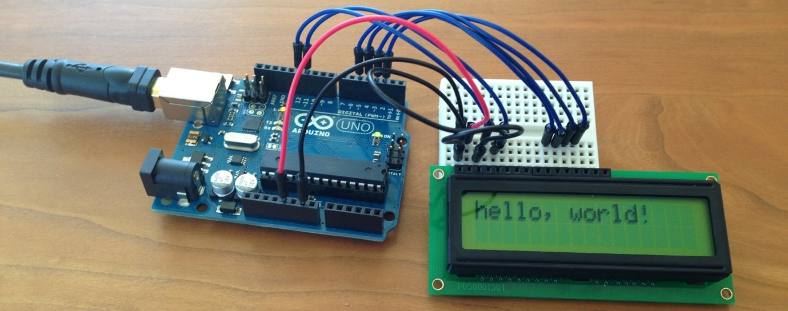
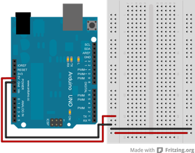

# Arduino

*Deze introductie in werken met de Arduino is gebasseerd op eerder werk van Freek Pols, licht aangepast door Rolf Hut voor Design Engineering voor Fysici en geschikt gemaakt als online materiaal door Mark Melotto.*

Een Arduino is een soort microcomputer. 
De Arduino sluit je aan op een computer waarbij je een programma stuurt naar de Arduino. 
De Arduino voert vervolgens je geschreven script uit en zorgt voor de uitvoer. 
Zo kan een koelkast op een bepaalde temperatuur gehouden worden, kan je een zelfrijdende robot aansturen, lichtsensoren maken en ga zo maar door. 
In deze module gaan we aan het werk met de Arduino en leren we de basismogelijkheden van een Arduino.

**LET OP**

Volg de juiste volgorde: Opdracht 1 --> Opdracht 2 --> Programmeren deel 1 --> Opdracht 3 --> Opdracht 4 -->
Programmeren deel 2 --> Elektronica --> Opdracht 5 --> Programmeren deel 3 --> Opdracht 6 --> **INLEVEREN**

## Arduino Intro
De Arduino Uno is een van de populairste microcontrollers voor hobbyisten, studenten en professionals. 
Het is een kleine, programmeerbare elektronica-board die je kunt gebruiken om allerlei creatieve projecten te maken, zoals robots, slimme apparaten en sensoren. 
Een belangrijk kenmerk van de Arduino Uno is de reeks pinnen die beschikbaar zijn voor interactie met andere elektronische componenten.

  

De Arduino Uno heeft verschillende soorten pinnen, elk met een specifieke functie, samengevat in onderstaande tabel.

|Categorie	|Pinnen	|Functie|
|---|---|---|
|Digitale pinnen|	0–13|	Digitale I/O, aan/uit, seriële communicatie|
|PWM pinnen|	~3, ~5, ~6, ~9, ~10, ~11|	Analoge simulatie (bijv. LED dimmen)|
|Analoge pinnen|	A0–A5|	Lezen van analoge sensoren|
|Voedingspinnen|	5V, 3.3V, GND, Vin|	Voeding en gronding van externe componenten|
|I²C-pinnen|	A4 (SDA), A5 (SCL)|	Communicatie met I²C-apparaten|
|SPI-pinnen|	MOSI, MISO, SCK|	SPI-communicatie|
|Reset pin|	RESET|	Herstart van de Arduino Uno|
|tx & rx| 1 & 2 | seriële communicatie|

Bij het werken met een Arduino heb je twee belangrijke onderdelen: De Arduino zelf en een breadboard. De Arduino is de computer, met invoer en uitvoer mogelijkheden. 
Op het breadboard wordt de elektronica aangesloten die aangestuurd wordt door de Arduino.

## Breadboard
Het breadboard heeft een plus en een min kolom, deze moet je aansluiten met de Arduino. 
De + kant sluit je aan op de5V uitgang of op een uitvoerpoort van de Arduino. 
De – kant sluit je aan op deGND (ground) van de Arduino.

  

Het breadboard heeft rijen en kolommen, zie hiernaast en hieronder voor een opgewerkte breadboard. 
De punten in een rij zijn met elkaar verbonden. Maar laten we hier niet te lang bij stil staan… 
we gaan aan de slag! 

