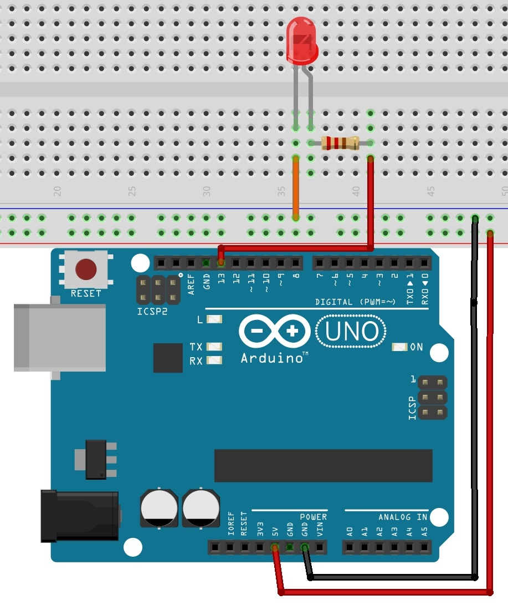
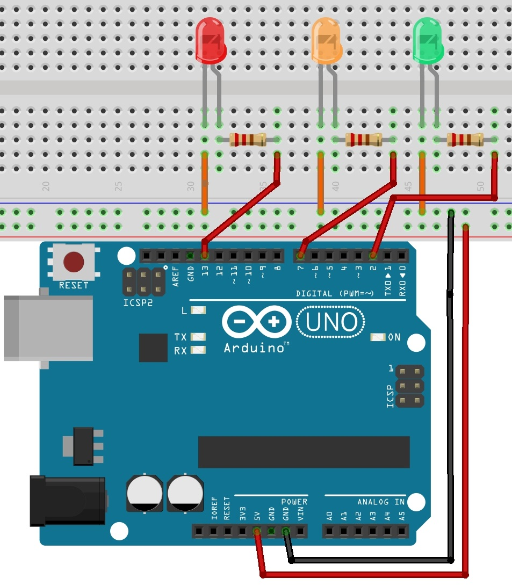

# Opdracht 2

##  Een knipperende LED
Nu kan je je led wel laten branden, maar daar heb je nog niet veel aan… 
Een volgende stap is de LED aansturen met behulp van een stukje code. 
Om de LED aan te sturen met behulp van code moet je de een uitvoerpoort van de Arduino verbinden met je LED. 
De 5V output heb je niet nodig, de uitvoerpoort van deArduino levert nu 5V.

a) Bouw de opstelling die je ziet in de tekening en sluit de Arduino aan op de computer.

  

b) Open het programma en open het script blink via: `bestand/voorbeelden/basis/blink`.

c) Controleer het script met het vinkje. 
Mocht het programma niet werken, dan geeft het onderaan een foutmelding weer (het kan zijn dat je de COM-poort moet toewijzen, dit doe je via hulpmiddelen/poort).

d) Upload het script naar je Arduino met het tekentje . (snelcode: ctrl + u)

e) Beschrijf kort wat je ziet. Probeer wat je ziet te verklaren met behulp van de code.

f) Verander het script zodat de LED sneller knippert.

g) Sluit drie verschillende LED lampjes aan, verander het script zodat ze om de beurt aan staan.

  

h) Verander het script en maak een verkeerslicht waarbij oranje maar even aan staat.
