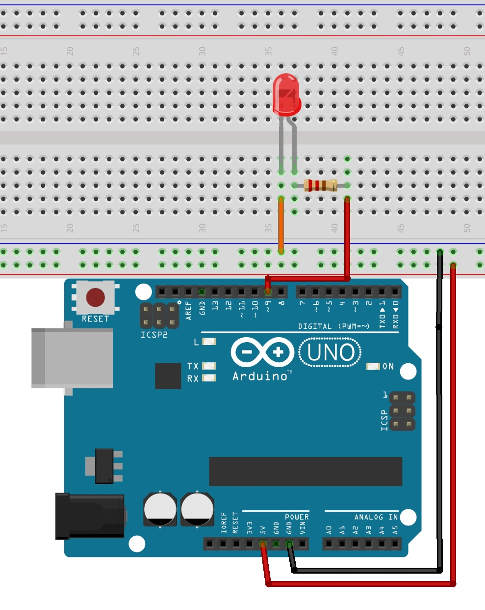

# Opdracht 3

## Een LED dimmen

a) Bouw de opstelling die hiernaast staat. Gebruik bij de output een pin met PWM.

<p>
  
</p>

b) Open het programma *Fade* in de ```examples/basics``` en upload het programma.

c) Beschrijf wat je ziet en probeer met behulp van de code een te verklaren wat er gebeurt.

d) Verander de code zodat de LED sneller volledig brandt en sneller uit is. 
Let op, er zijn twee manieren! Probeer ze allebei uit.

e) In de code staat ```analogWrite```. Eerder hebben we ```digitalWrite``` gebruikt. 
Leg uit waarom dat nu niet kan.