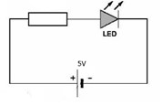
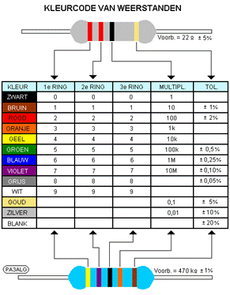
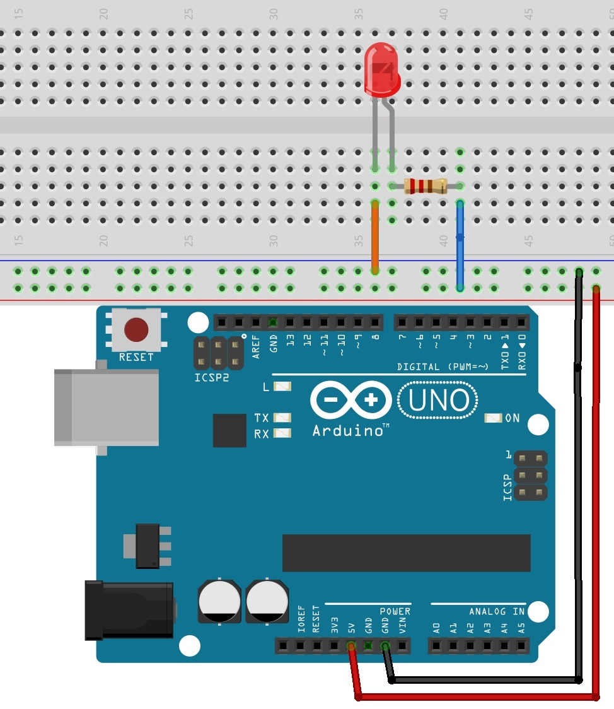

# Opdracht 1

## Het aansluiten van een LED

Een LED is een diode die licht uitzendt als er stroom door de LED gaat. 
De LED laat stroom maar door in één richting. 
De lange poot van de LED moet altijd aan de + kant aangesloten worden en de korte poot aan de - kant.

  

De stroom door een LED mag meestal maar 20 mA zijn waarbij de spanning over de LED 2,0 V is. 
De Arduino levert een 5,0 V spanning. De LED moet dus in serie geschakeld worden met een weerstand. 
De weerstand moet dus minimaal 150 Ω zijn (R = U / I = 3,0 / 0,020 = 150 Ω).

a) Er is geen weerstand aanwezig van 150 Ω maar wel een van 220 Ω. 
Zoek de weerstand op met behulp van de kleurcode: de eerste ring moet rood zijn, de tweede ring ook en de derde ring bruin (22·10). 
Een andere mogelijkheid is rood, rood, zwart, zwart.

  

b) Sluit nu de 5V uitgang van de Arduino aan op de **+** kolom en de **GND** (ground) uitgang van de Arduino aan op de – kolom. 

c) Sluit de LED en de weerstand in serie aan, zie de tekening.

  

d) Verbind de Arduino via de usb met de computer. Als je het goed hebt gedaan brandt de LED!

### fyi
Doordat de rode led bij lagere spanning licht uit zendt dan bijvoorbeeld een groene led, kun je een kleinere weerstand bij groene en blauwe led’s gebruiken. 
Zo branden ze uiteindelijk toch nog even fel!

|Kleur|Drempelspanning (V)|
|---|---|
|Blauw|2,3|
|Groen|2,0|
|Rood|1,5|
