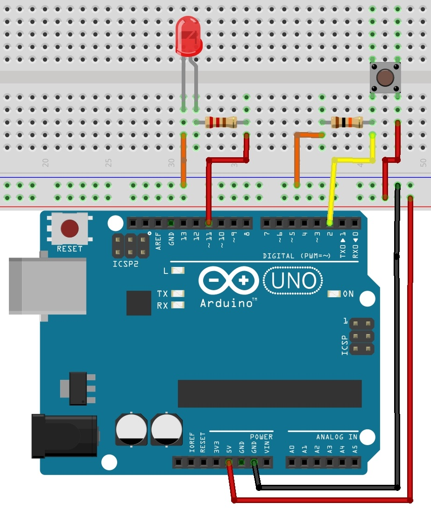

# Opdracht 4

## Een aan en uit knop voor de LED

We kunnen nu de LED met behulp van de code aan en uitzetten en zelfs dimmen. 
Maar vaak wil je ook een schakeling handmatig aan en uit kunnen zetten.
Daarvoor hebben we een drukknop nodig.

a) Bouw de schakeling die hiernaast staat. 
Let op dat je een grote weerstand gebruikt zodat de stroom niet te groot is.

<p align="center">
  
</p>

Het idee is nu dat we pin 2 gebruiken als ```INPUT```. 
Pin 2 meet dus de spanning. 
Dit gebeurt met de code ```digitalRead()```. 
Deze kan nu een hoog (5,0 V) of laag (0,0 V) signaal meten. 
Met een ```ANALOG IN``` kunnen ook tussen gelegen waardes gemeten worden. 
Pin 2 meet alleen een waarde als de knop (button) ingedrukt wordt.

b) Open het programma Button via examples/digital en upload het programma.

c) Druk op de knop en controleer wanneer de LED uit is en wanneer deze aan is.

d) Pas het programma aan zodat de functie van de knop precies omgedraaid wordt.


