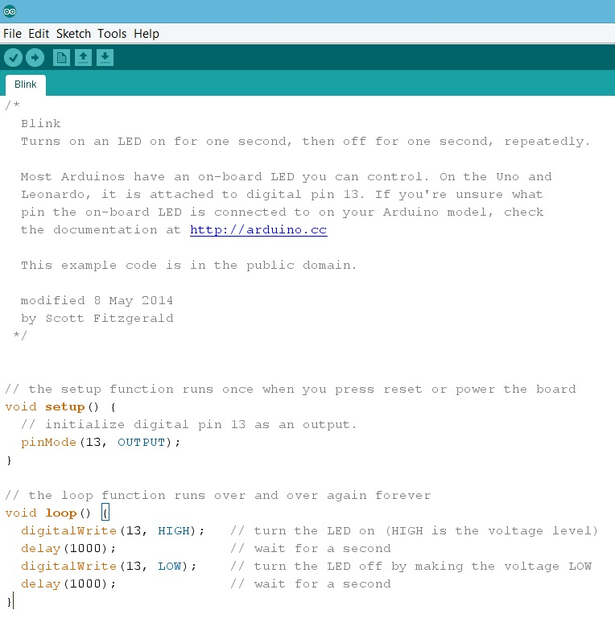
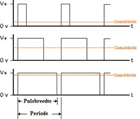
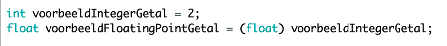

# Programmeren deel 1

Een Arduino programmeer je in een variant van de programmeertaal C. 
Heb je al ervaring met programmeren in C, dan is het heel makkelijk. 
Heb je geen ervaring met programmeren in C? Het is veel minder moeilijk dan je misschien wel denkt.

<p align="center">
  
</p>

Bovenaan het programma Blink staat /* dit betekent dat alles na dit begin tekenen voor het afsluitteken */ commentaar is. 
Hier zet je neer hoe het programma heet, wat het doet, wie het gemaakt heeft en wanneer je het voor het laatst veranderd hebt.

Een tweede mogelijkheid om commentaar toe te voegen is met behulp van //. 
Alles op dezelfde regel na // is commentaar. 
Zo kan je bijhouden wat de code op die regel doet.

Voordat het programma begint moet je zeggen wat er aangestuurd wordt. 
We geven aan dat in pin 13 iets zit en dat de Arduino daar een output (spanning) geeft als jij dat wilt.
Dit noemen we de ```setup```:
```
void setup(){
    pinmode(13, OUTPUT);
}
```
Na de setup beginnen we met de ```loop```:
```
void loop(){
    digitalWrite(13, HIGH);
    delay(1000);
    digitalWrite(13, LOW);
    delay(1000);
}
```


Alles wat tussen de accolades {} van de loop staat wordt herhaald. 
Eerst wordt pin 13 hoog (5,0 V) gemaakt met behulp van de code ```digitalWrite```. 
Daarna moet het programma 1000 ms wachten (```delay```) voordat de volgende regel code wordt uitgevoerd. 
De volgende regel code maakt pin 13 weer laag (0,0 V).
De pin wordt aangestuurd met een hoog of met een laagsignaal. 
Zit daar nog iets tussen? Ja en nee… 
De output is altijd 0,0 V of 5,0V. 
<p>
  
</p>
Maar je kan de LED wel dimmen door maar een bepaalde tijd de LED aan te zetten. 
Als je de LED snel genoeg knippert, zie je niet dat de LED knippert, het lijkt er alleen op dat de LED minder fel brandt. 
Wanneer je een LED wilt dimmen gebruikje een output met het symbool ~. 
Dit is een Puls WidthModulation (PWM). 
De waarde van de PWM zit tussen de 0(geheel uit) en 255 (geheel aan).

## Een aantal verschillen met Python

- Code wordt in zijn geheel gecompileerd en dan in zijn geheel uitgevoerd.
Python voert regel per regel uit, waardoor je “stops” kan invoeren. 
Dat kan in Arduino niet.
- Elke regel wordt afgesloten met een ;
- Inspringen (tabs) hebben geen effect op de werking van de code, maar maken deze wel leesbaar. 
- Blokken van “if” statements, of van een functie, worden bij elkaar gehouden door { }.
- Code wordt niet van boven naar beneden uitgevoerd, maar: de functie “setup()” wordt één keer uitgevoerd. 
Daarna wordt de functie “loop()” continue uitgevoerd.
- Voordat je een variable kan gebruiken moet je deze aanmaken (declareren) en daarbij aan de compiler duidelijk maken wat voor type de variabele is.
- Functies hebben ook een type. Het type van een functie geeft aan wat de functie als antwoord terug geeft (via het “return” commando). 
Het speciale type “void” geeft aan dat die functie niets terug geeft. 
- Bij een berekening bepaalt de types van de input wat het type van de output wordt. 
Als je bijvoorbeeld twee integers op elkaar deelt, krijg je een integer als antwoord. 
Dit gaat vaak fout wanneer je een verhouding moet uitrekenen!
- Het omzetten van een variabele naar een ander type heet “casten” en gaat als volgt:

Voor het omzetten naar tekst gelden andere regels!
