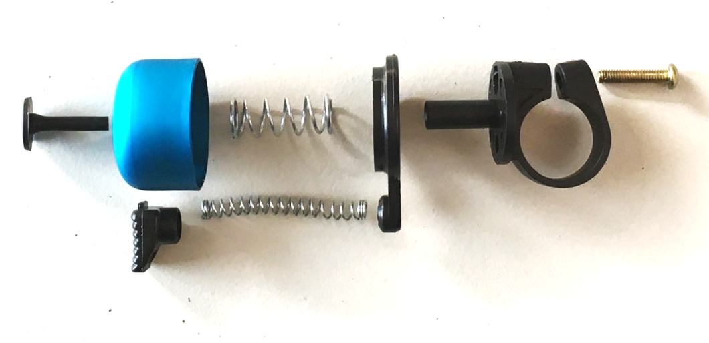
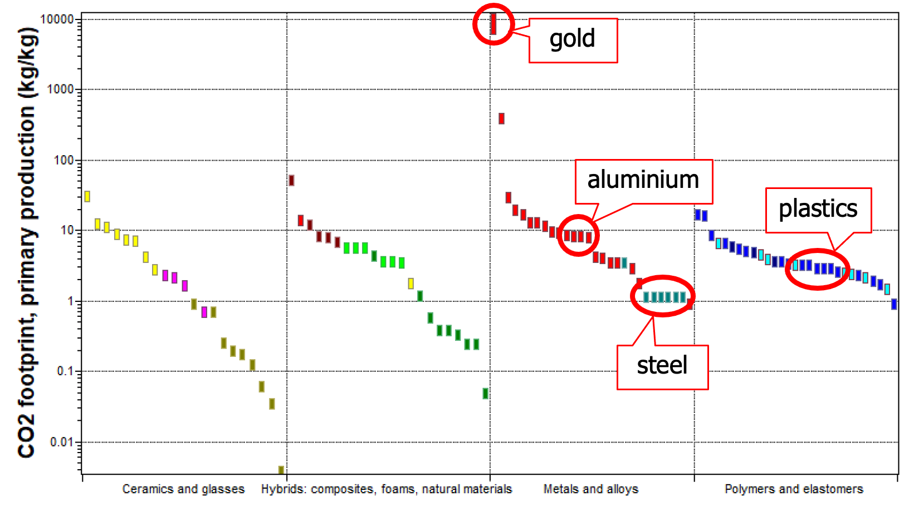
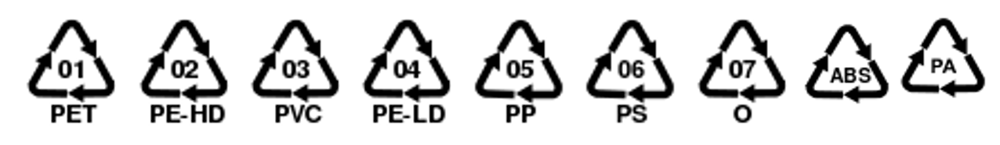
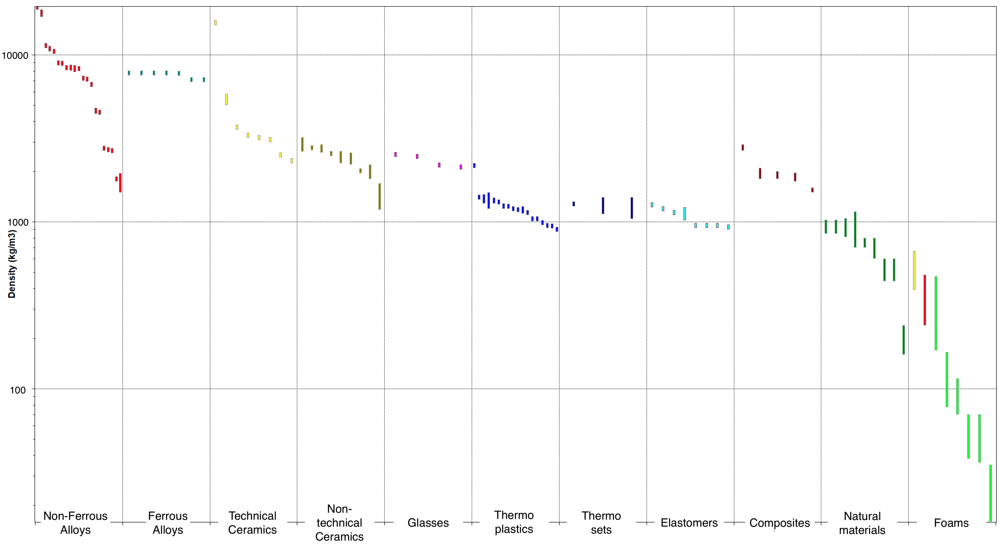
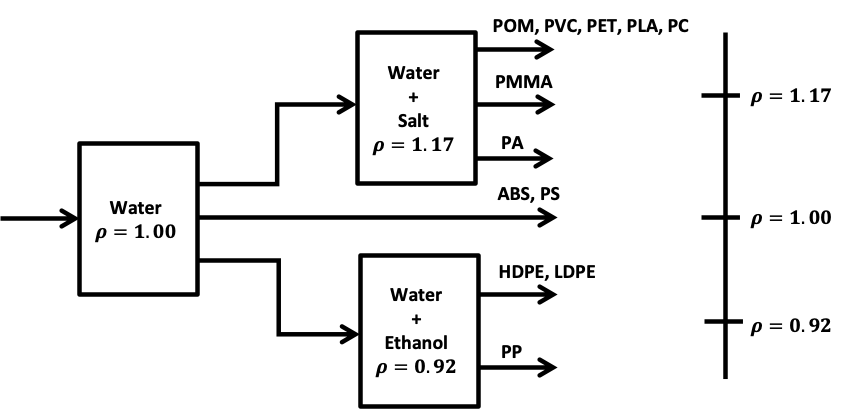
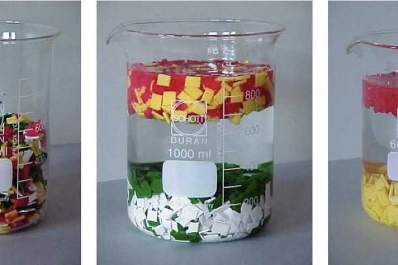
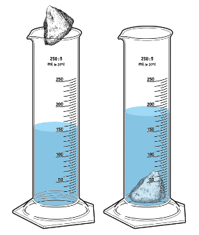

# Duurzaam ontwerpen
Samenvatting van de stof door Bas Flipsen, Universitair Hoofddocent, Industrieel Ontwerpen (2024)

## Introductie

Ieder product op deze aardbodem is gemaakt van een materiaal, geproduceerd en heeft waarschijnlijk ook een lange route afgelegd voordat het voor jou ligt en eindelijk aan zijn hoofdfunctie toekomt. Aan het einde van het gebruik wordt het weggegooid en hopelijk gerecycleerd. Het product voor je heeft dus al een lang leven achter de rug voordat het gebruikt wordt door jou. 

## Doel
Leren om tijdens het optwerpprocess na te denken over materiaal keuzes op basis van ontwerpcriteria, kosten en recyclebaarheid. Daarnaast ook leren om gebruikte materialen en de bijbehoredne kosten bij te houden door middel van een Bill of Materials.

## Levens Cyclus impact

Alle fasen in de levensduur van het product hebben ook invloed op het milieu. 
Materialen worden gedolven (zoals olie), omgezet in een materiaal (kunststof wordt gemaakt van olie), en middels een productieproces (zoals spuitgieten) omgezet tot een onderdeel. Vervolgens worden verschillende onderdelen samengevoegd (assemblage) tot een eindproduct Al deze fasen in het leven van het product kosten energie en materialen. Maar ook bijvoorbeeld het transport gedurende het productieprocess moet worden meegerekend.

In een Levens Cyclus Analyse of Assessment (LCA) worden deze impacts bij elkaar opgeteld. Je kan vervolgens achterhalen welke fase (productie, distributie, gebruik of einde leven) het meeste impact heeft, of op welk onderdeel je moet focussen om de impact te verlagen. Met behulp van een LCA kan je dus focussen en, daar waar nodig, verbeteringen doorvoeren. 

LCA's maken is een vak apart. In dit vak gaan we dit niet doen, maar maken we een zogenaamde "**eco-geïnformeerde analyse**". Hierbij focussen we onszelf op de productiefase, van *cradle-to-gate*, en dan voornamelijk op de milieubelasting van alleen de materialen gebruikt in het product. In veel gevallen kan je hiermee al snel een indicatie krijgen waar je je op moet focussen. Gebruikt een product veel energie (zoals bij een wasmachine) dan is dit ook een belangrijk focuspunt. 

## Bill of Materials (BOM)

Om een eco-geïnformeerde analyse te maken beginnen we met een bill of materials, (of in het kort BOM) van het product. 

Als je start vanaf een bestaand product, ontmantel het product en bepaal welke materialen er gebruikt zijn. Middels bekende milieu-indicatoren zoals klimaatverandering (Global Warming Potential, GWP100) uitgedrukt in $kgCO_{2}$-equivalent, of watergebruik uitgedrukt in $m^3$ world eq. deprived. Er zijn veel verschillende indicatoren, en [Bassi et al (2023)](https://dx.doi.org/10.2760/798894) geeft je een mooi overzicht hiervan. Binnen dit vak gaan we ons focussen op GWP, de impact van het materiaalverbruik op klimaatverandering.

Hierboven zie je de Action Techno fietsbel en hieronder de BOM ervan.  Naast de massa van ieder onderdeel is ook de GWP milieubelasting van het materiaal opgenomen in de laatste kolom. Deze is berekend door het product te nemen van de massa van onderdeel $i$ en de impact van het materiaal per kilogram:

$$
GWP_{i}=m_{i}\cdot I_{materiaal}
$$

| no. $i$        | naam        | materiaal          | massa $m$ (g) | GWP ($gCO_2$) |
| -------------- | ----------- | ------------------ | -------------:| --------------------:|
| 9              | klepelveer  | hoog koolstofstaal | 0,7           | 1,67                 |
| 8              | klepel      | HDPE               | 1,4           | 2,60                 |
| 7              | beldopnagel | PP                 | 0,7           | 2,04                 |
| 6              | beldop      | aluminium          | 5,5           | 71,78                |
| 5              | stelveer    | hoog koolstofstaal | 1,3           | 3,09                 |
| 4              | basis       | HDPE               | 3,0           | 5,58                 |
| 3              | moer        | laaggeleerd staal  | 1,7           | 4,23                 |
| 2              | klem        | PP                 | 5,8           | 16,94                |
| 1              | bout        | laaggeleerd staal  | 0,7           | 1,74                 |
| $\sum_{i=1}^9$ |             |                    | 20,8          | 109,68               |

Zoals je misschien opvalt is de impact van de aluminium beldop ($i=6$) erg hoog ten opzichte van de overige onderdelen. Het onderdeel telt voor 26% mee aan het totaalgewicht maar draagt in zijn eentje voor 65% bij aan de totale milieubelasting van het product. 

Met behulp van deze eenvoudige impact analyse kan je snel een indruk krijgen van de massa-milieu distributie, en op welk onderdeel je moet focussen om de milieubelasting met grote stappen te verlagen. 

In de figuur hieronder zie je een algemeen overzicht van de milieubelasting voor verschillende materialengroepen.

Zoals je ziet heeft aluminium een veel hogere impact $(9-10 kgCO_2/kg)$ ten opzichte van staal $(1-2 kgCO_2/kg)$, terwijl kunststof daar wat meer tussenin zit $(2-4 kgCO_2/kg)$. Meer waarden kan je terugvinden in betaalde databases zoals [Ansys Granta Edupack](https://www.ansys.com/products/materials/granta-edupack) (toegankelijk via de [TU Delft Software repository](https://software.tudelft.nl)) en [Ecoinvent](https://ecoinvent.org/), maar ook in open databases zoals [Idemat](https://www.ecocostsvalue.com/data-tools-books/). 

## Materiaaldeterminatie

Als je een BOM hebt van jouw product kan je een simpele eco-geïnformeerde analyse uitvoeren. Helaas komt het vaak voor dat je geen idee hebt waar een onderdeel van is gemaakt. Je dient dan eerst uit te zoeken waar ieder onderdeel van is gemaakt. 

*Maar, hoe identificeer je van welk materiaal het onderdeel is gemaakt?* 

Voordat we je enkele aanwijzingen geven, moet je weten dat het moeilijk is om de exacte materiaalspecificaties te identificeren, vooral wanneer het materiaal is gemengd met additieven (zoals vlamvertragers) of is gecombineerd met andere materialen voor verbeterde prestaties (zoals met glasfibers). We zullen ons daarom alleen richten op een algemene identificatie van materialen, zonder rekening te houden met additieven of combinaties. 

In Granta Edupack worden elf materiaalgroepen onderscheiden (zie ook het overzicht in bovenstaande figuur): 

1) Glas, zoals bierflesjes.

2) Niet-technisch keramiek, zoals bloempotten en porselein gemaakt uit natuurlijke materialen zoals klei.

3) Technisch keramiek, klassieke keramieken die technologisch zijn verbeterd en worden gebruikt in o.a. snijgereedschap, boren, isolatie voor ovens en kogellagers ([Technisch keramiek - Wikipedia](https://nl.wikipedia.org/wiki/Technisch_keramiek#:~:text=Technisch%20keramiek%20is%20een%20tak,toepassing%20van%20technisch%20keramische%20materialen.)). 

4) Composieten, samengestelde materialen bestaande uit twee soorten materialen, zoals vezelversterkte kunststoffen, zoals carbon fietsen of windmolenwieken.

5) Schuim, zoals verpakkingsschuim maar ook matrasschuim.

6) Natuurlijke materialen, zoals hout en vezels gemaakt van vlas.

7) Ferrometalen, dit zijn ijzerhoudende materialen zoals staal. 

8) Non-ferrometalen bevatten geen ijzer, zoals aluminium en magnesium.

9) Thermoplasten zijn polymeren die smelten zoals PET flesjes.

10) Thermoharders zijn polymeren die niet kunnen smelten zoals kunsthars (epoxie), waarbij twee materialen (hars en uitharder) worden samengevoegd en irreversibel uitharden.

11) Elastomeren bestaan uit materialen die een hoge mate van elasticiteit vertonen, zoals rubbers en elastiek.

Om een onderscheid te maken tussen deze families kan je of een destructieve analyse doen zoals de vlammentest beschreven door [Vishu Shah, 2007](https://www.consultekusa.com/plasticidentificationchart.html) of een non-destructieve analyse. We gaan voor het laatste zodat we het product na onze analyse nog kunnen gebruiken. 

### Visuele inspectie

Het gebruiken en trainen van al je zintuigen om materialen te determineren is een goede eigenschap van iedere ontwerper. Met je zintuigen kan je een eerste inschatting maken voor de materialengroep. Het verschil tussen metaal, hout en kunststof is niet heel complex.

Metalen zijn, als ze niet gecoat zijn vaak te herkennen aan hun kleur. Staal heeft vaak een donker kleur, terwijl aluminium mat overkomt. Koper is rood-geel en en goud juist heel gelig. Ga eens langs bij een metaalwinkel, en train je kleurenkennis voor verschillende materialen.

In consumentenproducten worden thermoharders niet vaak gebruikt, waardoor kunststoffen voornamelijk thermoplastische polymeren blijken te zijn. Met behulp van visuele inspectie is kan je kijken naar o.a. transparantie waarmee je de eerste materialen al kan deduceren. Polymeren kunnen worden beschreven op een ranglijst van vier niveaus, variërend van Waterhelder, Transparant, Translucent tot Opaak. De meest gebruikte transparante polymeren zijn vaak de goedkoopste, namelijk: PET, PS en PMMA. Ook PC en Polyester kunnen zo helder als water zijn.

Naast het gevoel van massa, de transparantie en de thermische geleiding kan je voor kunststof ook kijken naar de zogenaamde "recycling code" . Deze code is in het leven geroepen om achteraf voornamelijk verpakkingskunststoffen te kunnen sorteren. De code betekend niet per definitie dat het materiaal ook daadwerkelijk wordt gerecycleerd!

De bovenstaande figuur toont de recycling codes voor de 6 meest voorkomende kunststoffen. Recyclingcode nummer 7 wordt gebruikt voor alle andere kunststoffen "O", waaronder ABS (vaak gebruikt in consumentenelektronica) en PA (Nylon). Hogere nummers worden gebruikt voor andere materialen, zoals 12 voor Lithium batterijen, 20 voor golfkarton, 22 voor papier en 60 voor Katoen. Meer informatie over recyclingcodes is te vinden op ([Recycling codes - Wikipedia](https://en.wikipedia.org/wiki/Recycling_codes)).

### Dichtheid bepalen

De dichtheid van een materiaal is een belangrijke eigenschap waarmee je producten en productgroepen kunt identificeren. Onderstaande grafiek geeft een overzicht van de dichtheid van de verschillende materiaalgroepen.

 Je kan deze kennis gebruiken om een gevoel te krijgen voor lichte en zware materialen:

- Gemiddeld zijn **metalen** het zwaarst en hebben een dichtheid van rond de $8kg/dm^3$, behalve titanium $(4.5 kg/dm^3)$, aluminium $(2.7 kg/dm^3)$ en magnesium $(1.7 kg/dm^3)$. 

- Daarna volgen **keramiek** en **glas** met een gemiddelde dichtheid van ongeveer $2.5 kg/dm^3$. 

- **Polymeren** en **elastomeren** hebben een dichtheid van ongeveer $1 kg/dm^3$, wat ongeveer gelijk is aan de dichtheid van water. Daarom zullen sommige kunststoffen drijven en andere zinken. 

- **Natuurlijke materialen**, zoals hout, zijn vaak lichter dan water en zullen in de meeste gevallen drijven. 

- **Schuimen** zijn het lichtst met een dichtheid van minder dan $0.5 kg/dm^3$, voornamelijk vanwege de ingesloten lucht.

Omdat de bandbreedte van de dichtheid van kunststoffen zeer klein is en rond de $1.0kg/dm^3$ ligt, heb je een nauwkeurige meting van de dichtheid nodig. We doen dit door het drijvend vermogen van een object te meten.  Als het object zinkt, is het dichter dan de vloeistof, als het drijft, is het lichter dan de vloeistof. 

| Code   | Naam                                                                                                                               | Recycling code | Dichtheid (kg/dm3) |
| ------ | ---------------------------------------------------------------------------------------------------------------------------------- | -------------- | ------------------ |
| POM    | [Polyoxymethylene](https://en.wikipedia.org/wiki/Polyoxymethylene)                                                                 | 7              | 1.40               |
| PVC    | [Polyvinyl chloride](https://en.wikipedia.org/wiki/Polyvinyl_chloride "Polyvinyl chloride")                                        | 3              | 1.38               |
| PET(E) | [Polyethylene terephthalate](https://en.wikipedia.org/wiki/Polyethylene_terephthalate)                                             | 1              | 1.34               |
| PLA    | [Polylactic acid](https://en.wikipedia.org/wiki/Polylactic_acid)                                                                   | 7              | 1.25               |
| PC     | [Polycarbonate](https://en.wikipedia.org/wiki/Polycarbonate)                                                                       | 7              | 1.20               |
| PMMA   | [Polymethyl methacrylate](https://en.wikipedia.org/wiki/Poly(methyl_methacrylate))                                                 | 7              | 1.18               |
| PA     | [Polyamide](https://en.wikipedia.org/wiki/Polyamide "Polyamide")  ([Nylon](https://en.wikipedia.org/wiki/Nylon "Nylon"))           | 7              | 1.14               |
| ABS    | [Acrylonitrile butadiene styrene](https://en.wikipedia.org/wiki/Acrylonitrile_butadiene_styrene "Acrylonitrile butadiene styrene") | 7              | 1.04               |
| PS     | [Polystyrene](https://en.wikipedia.org/wiki/Polystyrene "Polystyrene")                                                             | 6              | 1.04               |
| HDPE   | [High-density polyethylene](https://en.wikipedia.org/wiki/HDPE "HDPE")                                                             | 2              | 0.96               |
| LDPE   | [Low-density polyethylene](https://en.wikipedia.org/wiki/LDPE "LDPE")                                                              | 4              | 0.94               |
| PP     | [Polypropylene](https://en.wikipedia.org/wiki/Polypropylene "Polypropylene")                                                       | 5              | 0.90               |

In bovenstaande tabel vind je de dichtheidsbereiken voor de meest voorkomende polymeren (recyclecode 1 tot 6) en technische polymeren (recyclecode 7) die in consumentenproducten worden gebruikt. 

Om de dichtheid van een object bij benadering te bepalen, heb je drie maatcilinders nodig met drie vloeistoffen van verschillende dichtheden (water-ethanol mix, puur water en een water-zout mix). 

Samen met bovenstaand schema kun je nu je eerste weloverwogen schatting maken:

1. **Lage dichtheid:** Om de dichtheid van de vloeistof te verlagen, kun je ethanol toevoegen aan water. Ethanol heeft een dichtheid van $0.79 kg/dm^3$. Maak een $60/40$ mix van kraanwater en ethanol, waardoor de dichtheid van de mix $0.92 kg/dm^3$ wordt. Je kunt natuurlijk de mix veranderen en een vloeistof produceren met een dichtheid tussen 0.79 (puur ethanol) en 1.00 (puur kraanwater).
2. **Basisdichtheid:** Deze cilinder bevat 100% kraanwater met een dichtheid van $1,00 kg/dm^3$.
3. **Hoge dichtheid:** Om de dichtheid van de vloeistof te verhogen, kun je glycerine toevoegen, die een dichtheid van $1,26 kg/dm^3$ heeft. Door de fractie water/glycerine te veranderen, kun je een vloeistof produceren met een dichtheid tussen $1.00$ (puur water) en $1.26$ (pure glycerine). Als glycerine niet beschikbaar is, kun je ook keukenzout gebruiken. Door zout op te lossen in water kan de resulterende vloeistof een dichtheid van ongeveer $1.17 kg/dm^3$ bereiken. Voeg 34 gram keukenzout toe aan 100 ml kraanwater en roer het met een roermotor. Laat de oplossing een nacht staan en decanteer voorzichtig het heldere zout.

Metalen kunnen ook gemakkelijk worden onderscheiden door de dichtheid van het object. De massa $m$ is eenvoudig te bepalen met een weegschaaltje.
In plaats van gebruik te maken van de afmetingen, kunnen we het volume ook in één keer meten door het object in water onder te dompelen. De verandering van het waterniveau bepaald dan het volume van het object. Samen met de massa van het object kan de dichtheid worden berekend met de massa $m$ te delen door het volume $V$:

$$
\rho=\frac{m}{V}
$$

Zorg ervoor dat de nauwkeurigheid van de weegschaal hoog genoeg is voor een nuttige massameting. Voor kleinere objecten in consumentenproducten zou een nauwkeurigheid van 0.01 tot 0.1 gram voldoende moeten zijn.

Na het wegen plaats je het object in een maatcilinder gevuld met water. Wanneer het object naar de bodem zinkt, kun je de verplaatsing meten. De waarde waarmee de vloeistof stijgt in de cilinder is gelijk aan het volume $V$ van het object.

Houd er rekening mee dat het object solide moet zijn, zonder ingesloten luchtbellen, of verwijder potentiële luchtbellen. Wanneer je de dichtheid hebt berekend, kun je deze vergelijken met de waarden voor verschillende metalen in onderstaande tabel en een weloverwogen schatting maken.

| Code | Naam            | Recycling code | dictheid (kg/dm3) | Magnetisch |
| ---- | --------------- | -------------- | ----------------- | ---------- |
| Au   | Goud            | -              | 19.4              | nee        |
| Ag   | Zilver          | -              | 10.5              | nee        |
| Cu   | Koper           | -              | 8.9               | nee        |
| CuSn | Brons           | -              | 8.5               | nee        |
| Fe   | Staal           | 40             | 7.8               | ja         |
| Fe   | Roestvast staal | 40             | 7.8               | licht      |
| Zi   | Zink            | -              | 6.6               | nee        |
| Ti   | Titanium        | -              | 4.6               | nee        |
| Al   | Aluminium       | 41             | 2.7               | nee        |
| Mg   | Magnesium       | -              | 1.7               | nee        |

Let op RVS en staal hebben een gelijke dichtheid. Je kan deze alsnog differentiëren met behulp van de magnetentest uit het volgende hoofdstuk.
### Magnetentest

Sommige metalen hebben een eigenschap dat ze magnetisch kunnen zijn. Metalen die ijzer, kobalt of nikkel bevatten zijn magnetisch, zogenaamde Ferrometalen. Deze eigenschap is goed bruikbaar om metalen van elkaar te onderscheiden. Uit bovenstaande lijst van metalen is staal dus de enige die magnetische is, roestvast staal (ook bekend als roestvrij staal) kan ook magnetisch zijn, afhankelijk van de samenstelling. Vaak merk je dat een bordmagneet licht plakt aan RVS. Alle andere metalen zijn niet magnetisch. 

### Trekbankproef

Een laatste proef die je kunt doen is om het materiaal op trek of buiging te belasten. Als je een onderdeel hebt met een constante dwarsdoorsnede $A$ zou je met deze testen de elasticiteitsmodulus (Young's modulus) kunnen bepalen, door de elastische rek $\Delta l$ te meten bij een een gegeven trekbelasting $F$: 

$$
E=\frac{F/A}{\Delta l/l_0}
$$

## Ease of Disassembly

Naast de milieubelasting van je product is het ook belangrijk dat je product lang meegaat. Dit kan je realiseren met behulp van de R9 strategie, oftewel ontwerp je product voor:

0) Refuse

1) Rethink

2) Reduce

3) Reuse

4) Repair

5) Refurbish

6) Remanufacture

7) Repurpose

8) Recycle

9) Recover

Deze verschillende ontwerpstrategieën zijn een belangrijk onderdeel van Circular productontwerpen. Wanneer we focussen op strategie R4 (Repair) tot R8 (Recycle) is het belangrijk dat een product eenvoudig uit elkaar halen is (*ease-of-disassembly*).  

Een product bestaat uit meerdere onderdelen die mechanisch met elkaar zijn verbonden. We kunnen verbindingen opdelen in twee soorten:

1) reversible: makkelijk demonterbaar zonder schade aan onderdelen

2) Irreversible: Niet (makkelijk) demonteerbaar zonder schade aan onderdelen

In mechanische systemen zijn reversibele verbindingen cruciaal voor de modulaire constructie, onderhoudsvriendelijkheid en het eenvoudig aanpassen van assemblages. 

Mechanisch *irreversibele* verbindingen worden gekozen in situaties waar een permanente en vaak sterkere verbinding nodig is. Deze verbindingen bieden voordelen zoals hogere structurele integriteit en langer duur gebruik, maar brengen ook beperkingen met zich mee als het gaat om demontage en reparatie.

In onderstaande tabel staan een (niet volledig) aantal voorbeelden van reversibele (links) en irreversibele (rechts) verbindingen:

| Reversibel                | Irreversibel     |
|:--------------- | ------------ |
| **Schroeven en Bouten:** een schroef draait zich vast in het materiaal, terwijl bij een bout de objecten worden verbonden en vastgezet door de combinatie van een bout met een moer. Ze kunnen eenvoudig worden los- en opnieuw vastgedraaid.                                                   | **Nagels, spijkers en nietjes**: deze verbinding is semi-reversibel en wordt in materialen geslagen met een hamer of geschoten met een tacker. Deze verbindingselementen kunnen eenvoudig worden verwijderd, maar de verbinding kan vaak niet hergebruikt worden. Ze worden vaak gebruikt bij zachte materialen zoals hout en soms in kunststof. |
| **Klikverbindingen:** dit zijn mechanische verbindingen waarbij onderdelen door middel van elastische vervorming in elkaar klikken. Ze kunnen vaak meerdere keren worden losgemaakt en weer bevestigd zonder schade. Klikverbindingen zie je vaak terug in consumentenelektronica, zoals batterijkapjes en kunststof kappen die  netjes aangesloten moeten worden (rij van kliks). | **Popnagels:** zijn bevestigingsmiddelen die ontworpen zijn om slechts eenmalig te worden bevestigd en niet zonder schade te worden verwijderd. In de te verbinden platen of onderdelen word een gat geboord, waarna van 1 zijde de popnagel wordt geplaatst. Middels een tang wordt de verbinding tot stand gebracht. Simpel, snel, sterk, maar niet herbruikbaar. Wanneer je de popnagel wilt verwijderen kan je hem uitboren, of wegfrezen.     |
| **Bajonetsluitingen:** een verbinding waarbij een onderdeel in een ander onderdeel wordt gestoken en vervolgens door een draaiende beweging wordt vastgezet. Deze verbindingen worden vaak gebruikt in camera-objectieven en lampfittingen.                                       | **Lassenverbindingen:** Lassen is een proces waarbij twee metalen oppervlakken worden samengesmolten met behulp van warmte, druk, of beide, vaak met toevoeging van een vulmateriaal.                                                                                                          |
| **Quick-release Mechanismen:** Door middel van een klemverbinding worden twee onderdelen vast gezet. Voorbeelden zijn fietswielspanners en bepaalde type koppelingen voor slangen of kabels.                                                                                                                                                                                                                                                        | **Soldeerverbindingen:** worden gevormd door het smelten van een vulmateriaal (soldeer) om twee oppervlakken te verbinden. In tegenstelling tot lassen, worden de te verbinden onderdelen niet gesmolten. De werktemperatuur is daarom ook veel lager, en de verbinding minder sterk.                                                                                                                                                                                                          |
| **Klittenband (Velcro):** is een veelgebruikte verbinding in textiel en kleding waarbij kleine haakjes zich vastzetten aan draadlussen.  De onderdelen zijn middels een trekkracht eenvoudig van elkaar te halen en terug te plaatsen.                                                                                                                                                                                                                 | **Krimp-, knel- en Persverbindingen:** zijn verbindingen waarbij een materiaal (meestal een metalen huls) wordt vervormd om stevig rond een ander onderdeel te passen. Je ziet ze vooral terug in kabelschoenen die aan de uiteinden van kabels worden geplaatst om zo met elkaar of aan andere objecten te verbinden.                                                                                                                                                                  |
| **Magneetverbindingen:** worden gebruikt in allerlei toepassingen, van meubelmagneten tot magnetische oplaadkabels.  Deze verbindingen kunnen eenvoudig worden losgemaakt door de magneten van elkaar te trekken. Je ziet ze vaak terug in naambordjes en in het verpakkingsdoosje van je smartphone.      | **Lijmen:** vormen sterke, permanente verbindingen tussen oppervlakken. Er zijn twee soorten lijmverbindingen: rigide (epoxies), met hoge treksterkte, en flexibele lijmen. Regide lijmen kunnen alleen verwijderd worden door vernietiging en flexible lijmen worden zacht als je ze opwarmt.                                                             | 
### Tape
Een verbinding die niet aan bod is gekomen is *tape*. Je kan onderdelen bij elkaar houden middels Ductape. Meestal is dit een pleisteroplossing, niet zo zeer ontworpen voor duurzaam verbinden. Verbindingen met tape zie je dan ook weinig in producten terug, maar voornamelijk in snelle reparaties.