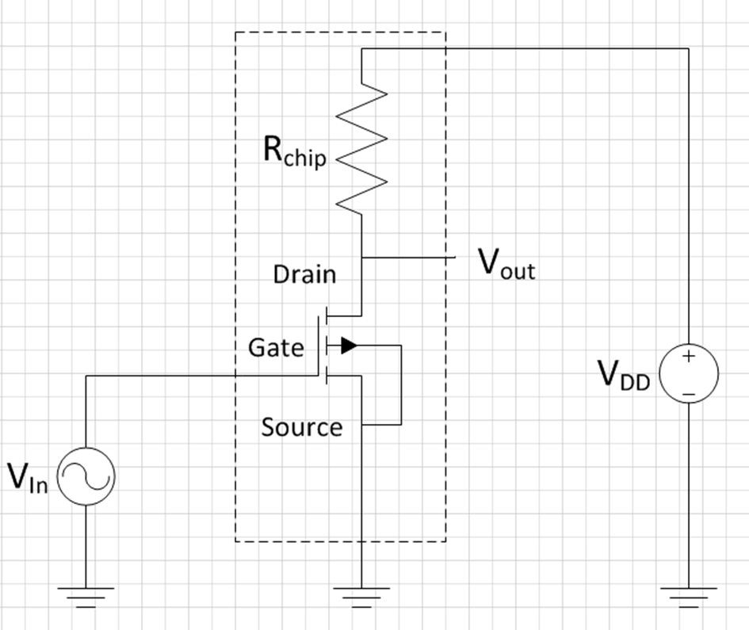

# Ontwerp een transistor

In this assignment, you will design, on a single chip, a two components integrated circuit consisting of a transistor and a resistor. You will first have to simulate the circuit in the computer program “LTSpice” to obtain the required behavior and component values. After this, the lay-out of the devices must be drawn in another computer program: “KLayout”. Based on this lay-out, chips will be fabricated with the dimensions you designed.

Figure 1: Electrical circuit for design assignment. The components in the dashed box will be your integrated circuit. The voltage sources are for power and supplying the input signal. In the actual LTSpice circuit, additional parasitic components are added to account for the pad and wire capacitances.

Figure 1 shows the electrical circuit you will be working with. It consists of a transistor labelled NMOS1 in LTSPICE and a resistor called RChip. Two voltages sources are added to simulate the power supply (VDD) and input voltage (Vin­), Vout is the output voltage which will go to the oscilloscope when you measure the device after fabrication.

By applying a voltage on the input (gate), the resistance between the drain and source will be modulated. Due to this a current going from drain to source will be modulated. A minimum voltage is required to form a channel between source and drain, which is called the threshold voltage (VTh). For voltages above VTh the transistor will form a conductive path between source and drain. As the gate is electrically isolated from the source and drain by 100 nm of SiO2, ideally no current will flow from the gate to the source or drain. Remember that since current is a flow of charged particles, which are electrons with a negative charge, the charge carriers move from source to drain. Hence their names.

For a current to flow from the drain to the source, a so-called drain-source voltage must be applied. This could be done by connecting the source to a voltage supply, however, in such a case the output voltage of the transistor will always be 5 V and only the current is modulated by the gate voltage. If we want to make a circuit where an input voltage on the gate controls an output voltage (Vout) on the drain of the transistor, we need to add a resistor between the drain and the power supply, as shown in figure 1.

As the transistor between the drain and source has a finite resistance, which is controlled by the gate, we now end up with this transistor resistor in series with the on-chip resistor Rchip. This acts as a so-called voltage divider: the voltage at Vout equals the current which goes to through RChip and the transistor, times the on resistance of the transistor. Mathematically:

$V_{out} = \frac{R_{Transistor}}{R_{Transistor} + R_{chip}} C_{dd}$ (1)

We can control the value of RChip through its dimensions (l, w) as explained in the KLayout manual and repeated here in eq. 2.

$R_{Chip} = \frac{\rho l}{A} = \frac{\rho l}{d w} = R_{s}\frac{l}{w}$ (2)

The value of RTransistor depends on its operation region and its dimensions W and L. Here W is the width of the channel and L the length of the channel. In general, a wider and/or narrower transistor has a lower on-resistance.

The resistance can also be estimated. In the saturation regime (digital assignment):

$R_{Transistor} = \frac{1}{\mu_n C_{ox} \frac{W}{L}(V_{GS} - V_{Th})} = \frac{L}{\mu_n C_{ox} W(V_{GS} - V_{Th})}$ (3) 

While in the linear regime (analog assignment):

$R_{Transistor} = \frac{1}{\mu_n C_{ox} \frac{W}{L} V_{DS}} = \frac{L}{\mu_n C_{ox} W V_{DS}}$(4)

Where µn­ is the mobility of electrons in Si (596 cm2/Vs in our model), Cox the capacitance per unit area of the 100 nm thick gate-oxide, and VTh the threshold voltage (1.1 ± 0.1 V). These are process-depended and cannot be controlled by the designer (which is you in this assignment). Only the W and L can be changed, within the specifications of the design rules as mentioned in the KLayout manual. In the digital assignment the relevant VGS are 0V and 5V, in the analog assignment you can assume VDS is typically between 2-3 V.

As a group, you can choose between two design assignments: either a digital signal inverter (‘not gate’) can be made or an audio amplifier. First, you will simulate the design you chose, after this, you will translate it into a lay-out.

## Part one: simulations
### Warm-up: contact pad capacitance
In both versions of the assignment (described below) you will have to consider that the 1 by 1 mm contact pads on your chip will have a capacitance that is not neglectable. Remember the assignment from last week and realize that the contact pads together with the grounded bottom of the chip can be considered as plate capacitors with 100 nm silicon dioxide. Calculate what the capacitance of the contact pads is. You will need to put the value that you’ve calculated in the relevant elements of the LTSpice simulation.

### Both assignments: tolerances
First, using what you learned in the lecture on tolerances last Monday and the equations applied above, derive the equation for the uncertainty in the output. Use the following information:

- The dimensions on the chip can vary due to fluctuations in the exposure energy or resist thickness. The maximum absolute variation this can give is ± 200 nm of the designed dimensions. The typical size of a structure is about 10 micrometers.
- Another source of variation in our process is the sheet resistance (Rs­) of the resistor, which strongly depends on the implantation dose and annealing temperature. In our process, the sheet resistance can vary ±10%.
- You may assume that the value of Rchip and Rtransistor are about equal (but their uncertainties are not!).
- You may also assume that the uncertainty in VGS and VDS is neglectable.
Follow these steps:

1. If needed, calculate the uncertainty in (VGS – Vth) first. Neglect terms that can be neglected.
2. Calculate the relative uncertainty in Rchip and Rtransistor. Neglect terms that can be neglected
3. Use the equation for the uncertainty of a voltage divider to derive the uncertainty in de output Voltage.

Calculate which of the variations in the production process will have the largest impact on your output Voltage? (This should take no more than 15 minutes, if you get stuck ask help).
1. 
2. Show the derived uncertainty equation and your answer to the above question to your TA before moving on.
2. On the sheet your TA gave you is a table with “problem -> cause -> solution”. Fill in this table and show it to your TA.
*Now you can move on to simulating in LTSpice, but before simulating, first, read the LTSpice manual!*

## Assignment option 1: digital inverter
Template: NMOS_EKL_digital_template_group_XYZ.asc

A digital inverter gives a high output when the input is low, and vice versa, and is the basic building block of any digital circuit. Here the transistor acts like a switch with a finite on-resistance. The goal of the assignment is to have a circuit that can invert a 20 kHz square wave as good as possible. This means that when 0 V is supplied to the gate the output should be close to 5 V, and when 5 V is supplied it should be close to 0 V.

*Your design assignment is to make a chip where you adjust the width and length of the transistor, and the value of RChip in such a way that the inverter reaches the required voltages as close as possible, but at least within 250 mV of the nominal value of 0 or 5 V at the end of each pulse.*

*When you get your own chip, you will have to show that this works!*

Transient simulations, that is simulations with time on the x-axis, are the most useful for this in LTSpice. In the template a 5 V square wave is connected to the gate, which has an on-period of 25 µs and total period of 50 µs (which equals 20 kHz). You can change these numbers by right-clicking on the VIn source.

Once you have this working you should try to improve the performance of your chip using the below steps:

1. The power consumption when the transistor is on can be quite high. This is undesired behavior and can be reduced by optimizing the W/L and RChip values. Add the power dissipated by RChip (remember, P = U∙I) to the simulation window and try to reduce the power consumption in the on-state (Vin = 5 V) to below 2.0 mW without sacrificing the previous specification. The maximum allowed dissipation is 3.0 mW.
2. Optional (if time permits): Digital circuits are fast! Try to determine the maximum frequency your circuit can operate at while still coming within 500 mV of the desired value at the end of the pulse. Can you improve your circuit to increase this maximum frequency? What happens to your power consumption?

All the specifications of the circuit will have to be documented in a datasheet in such a way that you can verify the performance on the second session of this workshop.

The dimensions on the chip can vary due to fluctuations in the exposure energy or resist thickness as you have calculated above. Before drawing the lay-out it is good practice to check the tolerances of your circuit. Simulate the impact of these variations on your circuit. If the factory reaches the edges of the specified variations, will your circuit still satisfy the criteria of the design?

## Assignment option 2: audio amplifier
Template: NMOS_EKL_analog_template_group_XYZ.asc

The circuit can also be used as an audio amplifier, for instance, to amplify the signal coming from a microphone. In this case, a small changing voltage is supplied to the gate, which is amplified at the output. The goal is to design an amplifier which can amplify a sine input by at least a factor 4, which means that the amplitude of the output voltage must be at least four times the amplitude of the input voltage.

*Your design assignment is to make a chip where you scale the DC offset voltage of the source, the RChip resistor, and the transistor dimensions in such a way that the gain of the circuit is at least 4 times the amplitude of the input signal (AC gain).*

*When you get your own chip, you will have to show that this works!*

Transient simulations, that is simulations with time on the x-axis, are the most useful for this in LTSpice. A sine wave with a frequency of 1 kHz can be simulated and has been added to the template, with an amplitude of 0.125 V and DC offset voltage of 2.5 V (remember VTh = 1.1 ± 0.1 V). The values can be changed by right-clicking on the voltage source. This offset voltage is required for two reasons: 1) to ensure that the transistor is on over the entire range of the input signal, and 2) to set the transistor in the right operation regime (the so-called linear regime) for maximum gain.

Once you have this working you should try to improve the performance of your chip:

1. Optimize the system such that it is also a good (at least 4 x) amplifier for higher frequencies. Try to get the biggest spread (ie. bandwith) of frequencies for which your amplifier works. Ideally at least 4x gain at 20 kHz for audio, but see if you can get it as high as 100 kHz.
2. Optional (if time permits) Explore for which amplitudes of the sine at the input the amplifier still gives a correct output, that is no distortion takes place. To analyze distortion, you can use the Fourier transform in the simulator: right-click the plot – View and select FFT. Now select the input and output signal. For an undistorted signal you should only see a peak at 1 kHz, once the signal starts to be deformed by the circuit additional peaks at higher frequencies will appear. Try to obtain a circuit which can at least process a sine with 0.2 V as amplitude for Vin with less than -20 dB distortion (= difference in dB between the fundamental frequency of 1 kHz and its first harmonic).

All the specifications of the circuit will have to be documented in a datasheet in such a way that you can verify the performance on the second session of this workshop.

The dimensions on the chip can vary due to fluctuations in the exposure energy or resist thickness as you have calculated above. Before drawing the lay-out it is good practice to check the tolerances of your circuit. Simulate the impact of these variations on your circuit. If the factory reaches the edges of the specified variations, will your circuit still satisfy the criteria of the design?

*You have to write down specifics from your LTSpice simulation on your sheet and show this to your TA before moving on the phase two: Layout.*

## Phase two: lay-out
Template: groupXYZ.gds

Now that you obtained an integrated circuit that meets the specification it is time to translate this into a physical lay-out. For this KLayout will be used. *Read the KLayout manual carefully and use it to map your design to a physical lay-out. After the lay-out has been finished, perform the design-rule check.* Any mistakes in the layout will be your own responsibility and that of the group which checked your design: they will not be checked before submitting them to the mask manufacturer. The final lay-out and LTSpice design will have to be submitted on Brightspace to get it fabricated.

## What to show to your TA during the day?
1. Your derived equation and related uncertainties
2. Your simulation in LTSpice before moving on to designing your layout in KLayout

## What to physically hand in?
The form that is on your table which includes:
1. A graph / figure describing the behavior of your designed chip
2. A design rules check done by another group of students (and signed by them!)

## What to digitally hand in on Brightspace?

1. Your final design template for LTSpice (*.asc), with your group number in the filename instead of the XYZ
2. Your final KLayout design file (*.gds), with your group number in the filename instead of the XYZ